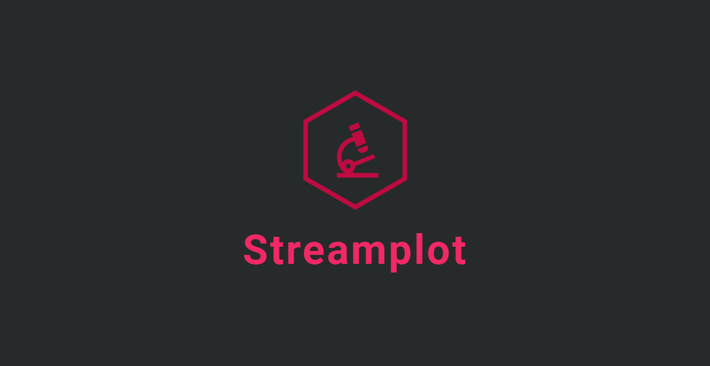
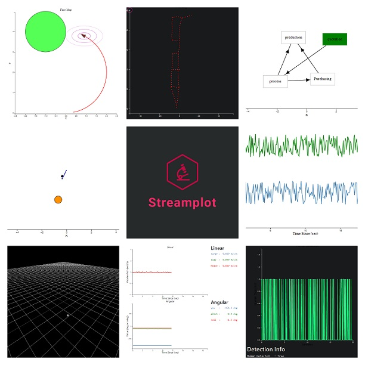
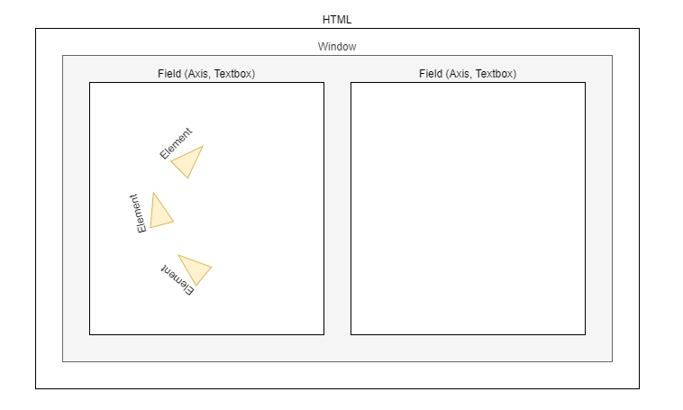

 </img>

 # Streamplot

Streamplot is a JavaScript library that provides tools for creating and updating plots and graphs in real time. It is particularly well-suited for visualizing live data, and offers a range of customization options to allow users to create plots that meet their specific needs. Streamplot includes functionality for displaying various types of data states, as well as adding interactive elements like pointers and circles to the plots. It is easy to use, making it a convenient choice for creating dynamic visualizations of data.

## Overview

A streamplot instance consists of multiple different components: 

### Window
This could be considered simply a container for multiple fields. It is typical that only one window would exist per HTML page, but this is not a strict requirement

The window also serves the purpose of updating all the Fields when changes are made to the elements 

### Field
In the current implementation, a field is either an **Axis** (For plotting lines, shapes, paths, ect.) or a **Textbox** (For rendering text). Both of these should be added to a Window

### Element
An element is used to render a datastate to an Axis. Each element is dependant on a datastate, and there is usually a 1-to-1 relationship between element classes and datastate classes

### Datastate
A Datastate is simply a container for data that will be rendered using an Element. Datastates are the entities that are resposible for keeping track of if an element needs to be re-rendered (as the data associated it has changed)

See following diagram for typical use:

## Example Code:
*These are minimilistic examples. See the examples/ folder for more complete examples*

#
1. Simple Line Plot:

        const { DataState, Window, Textbox, Element } = require("streamplot")
        
        var w = new Window($("#container"), {});

        var a = w.add_subplot({top:1,bottom:2,left:1,right:2},{
        width : 600,
        height : 400,
        margins : {
            top: 30, right: 20, bottom: 30, left: 50
        },
        xlim : [0,20],
        ylim : [-1.0,1.0],
        xlabel : "Time Since (sec)",
        ylabel : "Value"
        });

        let voltage = new DataState.TimeSince({tmax_seconds:20});
        let current = new DataState.TimeSince({tmax_seconds:20});
        let expected = new DataState.Path();

        a.plot(voltage, {scolor:"steelblue"});
        a.plot(current, {scolor:"green"});

        //Equivalent to a.plot():
        a.add_element(new Element.Line(expected, {scolor:"red"}))

        //Initialize the window (note that this is after adding the elements)
        w.init();
        w.start();

        //Create static line
        for (let i=0;i<20;i++)
            expected.push({x: i, y: (i/10)-1})

        //Update plot data
        setInterval(()=>{
            voltage.push(Math.random())
            current.push(Math.random()-1)
        }, 100)`